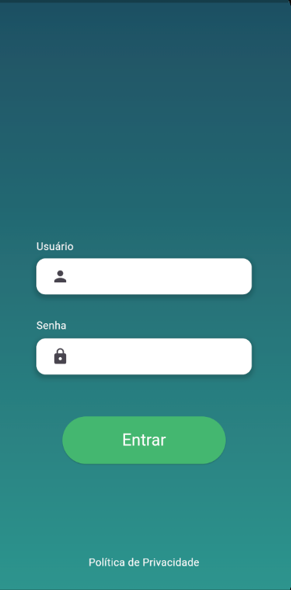
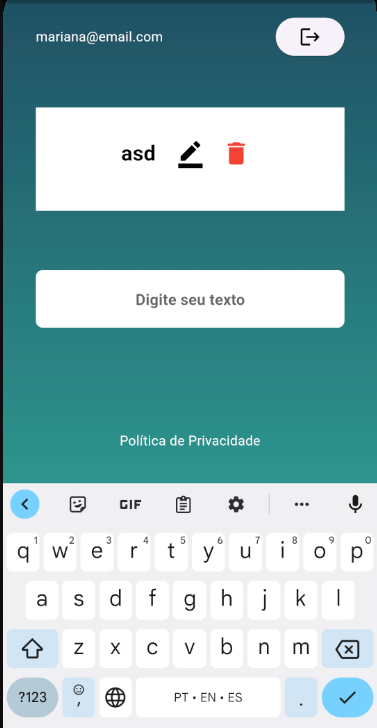

# ToDo List
- Este é um projeto de aplicativo de lista de tarefas desenvolvido em Flutter que utiliza o Firebase para autenticação e armazenamento de dados, o MobX para gerenciamento de estado e o Shared Preferences para armazenar dados localmente. O aplicativo permite que os usuários cadastrem suas tarefas e sincronizem os dados entre dispositivos.

## Funcionalidades

- Autenticação de Usuário: O aplicativo permite que usuários façam login ou se cadastrem usando o Firebase Authentication.

- Lista de Tarefas: Os usuários podem adicionar, editar e excluir tarefas.

- Sincronização em Tempo Real: As tarefas são sincronizadas em tempo real entre dispositivos usando o Firebase Realtime Database.

- Armazenamento Local: As informações do usuário são armazenadas localmente usando o Shared Preferences para garantir uma experiência contínua mesmo offline.

## Pré-requisitos

Certifique-se de ter o Flutter instalado em seu ambiente de desenvolvimento. 

1. Clone o repositório

        git clone https://github.com/marianaoliveira1/TodoListApp.git

2. Instale as dependências do Flutter:

        flutter pub get

3. Execute o aplicativo:

        flutter run

## Imagens

